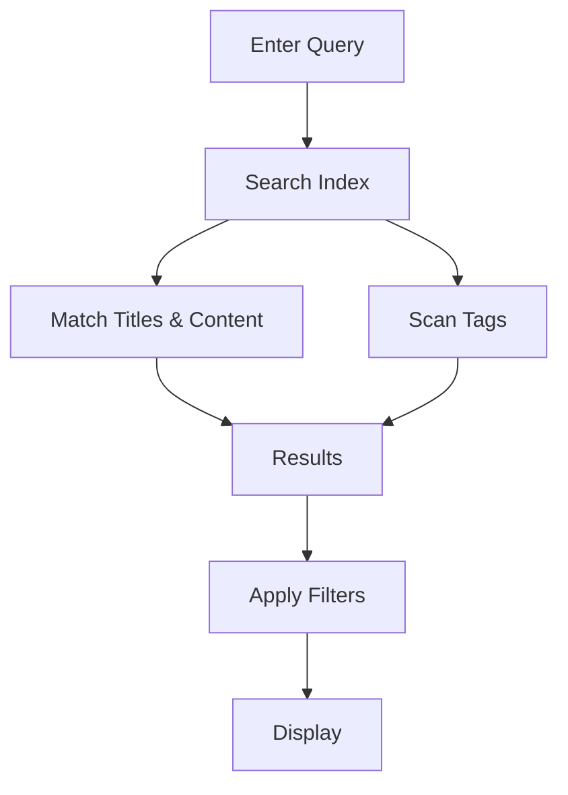

## Overview

Nyao provides powerful tools to manage your project documentation efficiently. You organize content into structured spaces, collaborate seamlessly with teams, track changes over time, and find information quickly using advanced search capabilities. These features help you maintain high-quality docs without complexity.

<Callout kind="info">
  Start by creating a new documentation space to experience these features firsthand.
</Callout>

## Key Features

<Columns cols={2}>
  <Card title="Document Organization" icon="folder" href="#document-organization">
    Structure your docs with folders, pages, and hierarchies for easy navigation.
  </Card>
  <Card title="Real-Time Collaboration" icon="users" href="#collaboration">
    Edit documents together with others in real time, like Google Docs.
  </Card>
  <Card title="Version History" icon="git-branch" href="#version-history">
    Track every change with full revision history and restore previous versions.
  </Card>
  <Card title="Search and Tagging" icon="search" href="#search-tagging">
    Quickly locate content using powerful search, tags, and filters.
  </Card>
</Columns>

## Document Organization and Structuring

Organize your documentation into logical structures using folders and pages. You create nested hierarchies to group related content, making it intuitive for readers to navigate.

<Steps>
  <Step title="Create a Folder" icon="folder-plus">
    Navigate to your space root and click the new folder button. Name it descriptively, like `API Reference`.
  </Step>
  <Step title="Add Pages" icon="file-plus">
    Inside a folder, create new pages. Use the drag-and-drop interface to reorder.
  </Step>
  <Step title="Set Permissions" icon="lock">
    Configure access levels for folders to control who can view or edit.
  </Step>
</Steps>

This approach keeps large projects manageable. For example, structure as `Getting Started` > `Installation` > platform-specific guides.

## Collaboration and Real-Time Editing

Invite team members to collaborate instantly. Multiple users edit the same page simultaneously, with changes appearing live.

<Tabs>
  <Tab title="Invite Collaborators" icon="user-plus">
    Go to space settings, enter email addresses, and assign roles like Editor or Viewer.
  </Tab>
  <Tab title="Live Editing" icon="edit-3">
    Open a page and see cursors from other users. Use `@mentions` to notify teammates.
  </Tab>
  <Tab title="Comments" icon="message-circle">
    Add inline comments for feedback without altering the main content.
  </Tab>
</Tabs>

<Callout kind="tip">
  Enable notifications in settings to stay updated on mentions and changes.
</Callout>

## Version History and Revisions

Nyao automatically saves every edit, providing a complete audit trail. You review changes, compare versions, and revert if needed.

<Expandable title="Advanced Version Management" default-open="false">

  Access history via the page menu. Each revision shows the author, timestamp, and diff highlights.

  ```javascript
  // Example: Programmatic access via Nyao API (if integrated)
  const revisions = await nyao.pages.getRevisions('doc-id');
  console.log(revisions[0].changes); // Latest changes
  ```

  Restore by selecting a version and clicking `Revert`.

</Expandable>

## Search, Tagging, and Filtering Tools

Find exactly what you need with full-text search across your entire space. Add tags to pages for categorization, then filter results dynamically.

| Feature       | Description                          | Example Usage                  |
|---------------|--------------------------------------|--------------------------------|
| Global Search | Searches titles, content, and tags   | Type `API authentication`     |
| Tags          | Custom labels like `v1.0`, `internal`| Filter by multiple tags       |
| Filters       | By date, author, or folder           | Recent changes by `@teamlead` |



Use tags like `#feature` or `#bugfix` to organize changelogs effectively.

<Columns cols={3}>
  <Card title="Quick Start" icon="rocket" href="/quickstart">
    Set up your first space.
  </Card>
  <Card title="Advanced Tips" icon="sparkles" href="/guides/advanced">
    Unlock pro features.
  </Card>
  <Card title="Support" icon="help-circle" href="/help-center">
    Get help when needed.
  </Card>
</Columns>