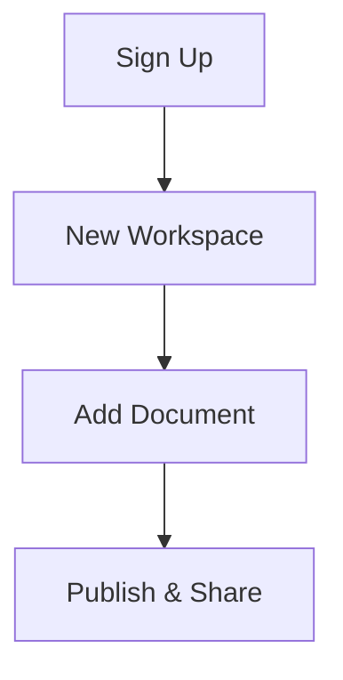

## Prerequisites

<Callout kind="info" title="Before You Begin">
You need a modern web browser like Chrome, Firefox, or Safari. No software installation required. An email address for account verification is recommended.
</Callout>

Nyao makes it easy to set up your documentation workspace. Follow these steps to get started in minutes.

## Step-by-Step Setup

<Steps>
  <Step title="Sign Up for Nyao" icon="user-plus">
    Visit `https://www.nyao.io` and click **Sign Up**.

    Fill in your email, create a password, and complete the verification process. Nyao uses secure email verification to protect your account.
  </Step>

  <Step title="Create Your First Workspace" icon="folder-plus">
    After logging in, select **New Workspace** from the dashboard.

    Enter a name like `My Project Docs` and choose a description. Workspaces organize your documentation spaces.
  </Step>

  <Step title="Add Initial Documents" icon="file-plus">
    Inside your workspace, click **Add Document**.

    Choose between manual entry or import. Start with a simple Markdown file for your README.

    ```markdown
    # Welcome to My Project

    This is your first document in Nyao.

    ## Features
    - Easy editing
    - Real-time previews
    ```
  </Step>

  <Step title="Explore Basic Navigation" icon="compass">
    Familiarize yourself with the interface:

    - **Sidebar**: Manage workspaces and documents
    - **Editor**: Write in Markdown with live preview
    - **Publish**: Share your docs publicly or privately

    Save your changes automatically syncs across devices.
  </Step>
</Steps>

## Adding Documents: Multiple Methods

Use these common approaches to populate your workspace.

<Tabs>
  <Tab title="Manual Creation" icon="edit-3">
    Create new files directly in the editor. Supports Markdown, HTML, and more.

    <Callout kind="tip">
      Use folders to organize large projects.
    </Callout>
  </Tab>

  <Tab title="Import from GitHub" icon="github">
    Connect your GitHub repo and import Markdown files automatically.

    Steps:
    1. Go to **Import** > **GitHub**
    2. Authorize Nyao
    3. Select repo and branch
  </Tab>

  <Tab title="Upload Files" icon="upload">
    Drag and drop local Markdown or text files into your workspace.
  </Tab>
</Tabs>



## Interface Overview

<Columns cols={3}>
  <Card title="Sidebar Navigation" icon="menu">
    Access workspaces, documents, and settings quickly.
  </Card>

  <Card title="Live Editor" icon="edit">
    Split view with Markdown source and rendered preview.
  </Card>

  <Card title="Publish Controls" icon="globe">
    Generate shareable links or embed codes.
  </Card>
</Columns>

## Next Steps

<Expandable title="Need Help?" default-open="true">
  Check these resources:

  | Topic | Description |
  |-------|-------------|
  | Collaboration | Invite team members |
  | Advanced Editing | Custom themes and components |
  | Integrations | GitHub, Slack webhooks |
</Expandable>

<Callout kind="success" title="Congratulations!">
  You've set up your first Nyao workspace. Explore [collaboration features](/authentication) or dive into [advanced guides](/introduction).
</Callout>